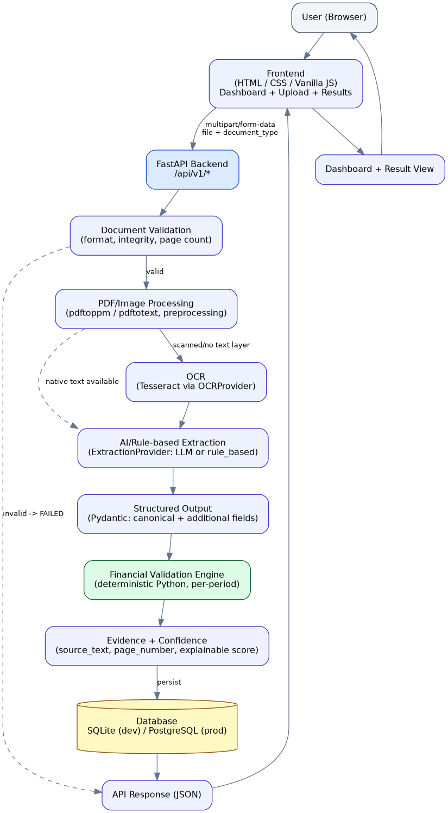

# Document Intelligence Platform

An end-to-end AI-powered Document Intelligence system built for an AI
Engineer Internship technical assessment. It ingests invoices, balance
sheets, profit & loss statements, and cash flow statements (PDF/JPG/PNG),
runs OCR + AI extraction, performs deterministic financial validation, and
exposes everything through a REST API and a small dashboard.

---

## 1. Problem statement

Financial back-offices receive documents (invoices, financial statements)
in inconsistent, often scanned/photographed formats. Manually re-keying
these into structured data is slow and error-prone. The goal of this
project is to automatically:

1. Accept an uploaded document + its declared type.
2. Validate the file, OCR it if needed, and extract **all** meaningful
   visible fields (not just a minimal set) into structured JSON, without
   hallucinating values that are not actually on the page.
3. Run deterministic financial-formula validation against the extracted
   numbers, understanding units, comparative periods, and negative/
   bracketed values.
4. Persist every result and expose it via a REST API and dashboard.

## 2. Solution overview

```
Upload -> File validation -> OCR (if needed) -> AI/rule-based field &
table extraction -> Structured JSON -> Financial validation -> Evidence/
confidence -> Persistent storage -> PASS/FAILED -> Dashboard + REST API
```

The system supports exactly four document types (selected explicitly by
the caller, not auto-classified): `invoice`, `balance_sheet`,
`profit_and_loss`, `cash_flow_statement`.

## 3. Architecture



```
project-root/
├── backend/
│   ├── app/
│   │   ├── main.py                       FastAPI app entrypoint
│   │   ├── api/routes/documents.py       REST endpoints
│   │   ├── core/{config,database,logging}.py
│   │   ├── models/document.py            SQLAlchemy ORM model
│   │   ├── schemas/{document,extraction}.py   Pydantic contracts
│   │   ├── services/
│   │   │   ├── document_validation_service.py
│   │   │   ├── ocr_service.py
│   │   │   ├── extraction_service.py
│   │   │   ├── financial_validation_service.py
│   │   │   └── document_service.py       pipeline orchestrator
│   │   ├── providers/
│   │   │   ├── ocr_providers.py          OCRProvider -> TesseractOCRProvider
│   │   │   └── extraction_providers.py   ExtractionProvider -> LLM / rule-based
│   │   ├── prompts/                      per-document-type LLM prompts
│   │   ├── repositories/document_repository.py
│   │   └── utils/{number_parser,image_utils,evidence_utils}.py
│   ├── tests/
│   ├── requirements.txt
│   └── Dockerfile
├── frontend/
│   ├── index.html
│   └── static/{css/style.css, js/app.js}
├── docs/architecture.png
├── sample_outputs/*.json          generated from REAL dataset runs
├── .env.example
├── docker-compose.yml
└── README.md   <- you are here
```

Clean separation is maintained between API, OCR, extraction, validation,
persistence, frontend, configuration, and tests, as required.

## 4. Technology stack & why

| Layer | Choice | Why |
|---|---|---|
| API framework | **FastAPI** | Async-friendly, automatic OpenAPI/Swagger docs, native Pydantic integration, minimal boilerplate for a 3-day assessment. |
| Validation/schemas | **Pydantic v2** | Enforces the structured-output contract on both the LLM's JSON and the API's request/response bodies; fails loudly on malformed shapes instead of silently propagating bad data. |
| OCR | **Tesseract** (via `pytesseract`) | Free, local, no API key/network dependency — works in restricted environments; swappable via the `OCRProvider` abstraction if a cloud OCR engine is preferred later. |
| PDF handling | **poppler-utils** (`pdftoppm`, `pdftotext`, `pdfinfo`) | Lightweight CLI tools with no compiled-extension dependency; used to detect native text layers, get page counts, and rasterize pages for OCR. |
| Image preprocessing | **OpenCV + Pillow** | Denoising/contrast/sharpening for noisy phone-photographed invoices; conservative so clean scans aren't degraded. |
| Semantic extraction | **Google Gemini (via Google's OpenAI-compatible API) with a deterministic rule-based fallback** | LLMs handle the genuine semantic variability in the dataset (different invoice layouts/currencies, financial statements whose fields change year to year); the rule-based fallback keeps the pipeline usable with zero external dependencies when no API key/network is available (see "Known limitations"). |
| Validation math | **Plain deterministic Python** | Financial correctness must be reproducible and auditable — never delegated to an LLM (see section 8). |
| Database | **SQLite (dev) / PostgreSQL (prod)** via SQLAlchemy | Zero-setup local development; a single `DATABASE_URL` change moves to a genuinely persistent Postgres instance for deployment. |
| Frontend | **Vanilla HTML/CSS/JS** | No build step, easy to statically host separately from the API, simple enough to fully explain in an interview. |

## 5. OCR approach

1. For PDFs, each page's **native text layer** is checked first
   (`pdftotext -layout`). If it yields fewer than 40 characters, the page
   is treated as scanned/flattened (this matched every HDFC financial
   statement PDF in the supplied dataset — all were "Print to PDF"
   flattened images with no text layer).
2. Pages needing OCR are rasterized at 300 DPI (`pdftoppm`) and passed
   through a **conservative preprocessing pipeline**
   (`utils/image_utils.py`): EXIF orientation correction, then either a
   mild contrast boost (clean scans) or denoise + adaptive contrast +
   sharpen (blurry/small/phone-photographed images), chosen automatically
   from a Laplacian-variance blur estimate and image size.
3. **Row reconstruction from word bounding boxes.** Tesseract's default
   `image_to_string` groups text into layout blocks/columns, which
   *scrambles tabular rows* — on the balance sheet PDFs this produced the
   label column, the schedule-number column, and the two value columns as
   three separate un-interleaved text blocks. This was discovered during
   real dataset testing and fixed by reconstructing rows directly from
   `image_to_data` word boxes: words are clustered by vertical position
   and sorted left-to-right within each cluster. This was the single
   highest-impact OCR fix in the project — it is what makes line-item
   `"label value1 value2"` alignment work at all for both the rule-based
   parser and the LLM prompt.
4. Every page tracks `ocr_used` and Tesseract's mean word confidence,
   which feeds into the (optional) explainable confidence score.

## 6. AI/LLM extraction approach

`providers/extraction_providers.py` defines an `ExtractionProvider`
abstraction with two implementations:

- **`LLMExtractionProvider`** (primary/production path) — calls **Google
  Gemini** through **Google's OpenAI-compatible API endpoint**
  (`https://generativelanguage.googleapis.com/v1beta/openai/`, documented
  at `https://ai.google.dev/gemini-api/docs/openai`). We use the official
  `openai` Python SDK purely as a generic OpenAI-protocol REST client —
  it is configured with Google's base URL and a **Gemini** API key
  (`LLM_API_KEY`), and is never pointed at OpenAI's own API service.
  `_get_client()` even refuses defensively to run if `GEMINI_BASE_URL` is
  ever misconfigured to point at `api.openai.com`. The provider builds the
  existing document-type-specific prompt
  (`prompts/{invoice,balance_sheet,profit_and_loss,cash_flow}_prompt.py`)
  from OCR text, calls `client.chat.completions.create(...,
  response_format={"type": "json_object"})` to request strict JSON output,
  and parses/validates the response into the shared `ExtractionResult`
  Pydantic model. Malformed JSON, API errors, and timeouts all raise a
  controlled `ExtractionProviderError` (with bounded retries and backoff)
  rather than crashing the request.
  > **This project does not use OpenAI's API service and does not require
  > an OpenAI API key anywhere.** The `openai` package is only a
  > protocol-compatible client library, the same way you might use a
  > MySQL client library to talk to a MySQL-compatible database that
  > isn't actually MySQL.
- **`RuleBasedExtractionProvider`** (offline fallback) — deterministic
  regex/heuristics over the row-reconstructed OCR text. Used automatically
  whenever `LLM_API_KEY` is empty (or the `openai` package can't be
  imported), so the whole pipeline (OCR -> extraction -> validation ->
  persistence -> API -> dashboard) runs and can be demonstrated with
  **zero external dependencies**. Every response produced by this
  provider carries an explicit `extraction_warnings` note saying
  reduced-coverage fallback logic was used.

`ExtractionService` selects the provider once via `get_extraction_provider()`
based on `LLM_PROVIDER`/`LLM_API_KEY`, so swapping providers never touches
pipeline orchestration code. Provider selection is fail-safe by design and
never raises (see "Provider selection" below).

### Provider selection

| `LLM_PROVIDER` | `LLM_API_KEY` | Result |
|---|---|---|
| `gemini` | set | `LLMExtractionProvider` (Gemini) |
| `gemini` | empty | `RuleBasedExtractionProvider` (safe fallback, warning logged) |
| `gemini` | set, but `openai` package not installed | `RuleBasedExtractionProvider` (safe fallback, warning logged) |
| `rule_based` | (irrelevant) | `RuleBasedExtractionProvider` |
| anything else / unset | (irrelevant) | `RuleBasedExtractionProvider` (safe fallback, warning logged) |

`GET /api/v1/health` reports both the **configured** provider
(`llm_provider`, i.e. whatever `LLM_PROVIDER` is set to) and the
**effective** provider actually in use after fallback logic
(`llm_provider_effective`), so the health check never claims Gemini is
active when it has silently fallen back to the rule-based path.

## 7. Extraction schema design


`schemas/extraction.py` uses the hybrid structure required by the case
study:

```
ExtractionResult
├── invoice_fields (InvoiceCanonicalFields) | statement_fields
├── invoice_line_items[] | statement_line_items[]  (LineItemField, with
│                                                    per-period evidence)
├── additional_fields{}     -- anything else visible, keyed by source label
├── periods[]
└── extraction_warnings[]
```

Every scalar is an `EvidenceValue` (`value`, `raw_text`, `source_text`,
`page_number`, `currency`, `unit_scale`) so provenance is never lost, and
`null` is always a legal, expected value.

## 8. Financial validation approach

`services/financial_validation_service.py` is **pure, deterministic
Python** — the LLM/OCR layer only extracts; it never judges correctness.
This separation (case study section 34) means every validation number is
reproducible and auditable independent of any AI provider.

Implemented checks:

- **Invoice**: quantity × unit price ≈ line total; sum(line totals) ≈
  subtotal; subtotal + tax − discount + shipping ≈ total (skipped, marked
  `NOT_APPLICABLE`-equivalent via a dedicated message, when
  `tax_inclusive=true`); cash − total ≈ change.
- **Balance sheet**: Total Capital & Liabilities ≈ Total Assets; sum of
  asset components ≈ reported Total Assets; sum of liability components ≈
  reported total — each run **independently per comparative period**.
- **Profit & Loss**: Total Income − Total Expenditure ≈ Net Profit before
  Minority Interest; that figure − Minority Interest ≈ Net Profit
  attributable to the Group — again per period, using whatever the source
  document's actual line items are (no generic revenue/COGS is invented
  for a bank's P&L).
- **Cash Flow**: Operating + Investing + Financing CF ≈ Net Increase in
  Cash; Opening Cash + Net Increase ≈ Closing Cash, per period.

Every check returns `PASS`, `FAIL`, or `NOT_APPLICABLE` (when a required
input was not extracted — never guessed) with `formula`, `operands`,
`calculated_value`, `reported_value`, `variance`, and `tolerance` so the
result is fully explainable.

**Tolerance strategy** (`utils/number_parser.approximately_equal`): a
check passes if it is within **either** an absolute tolerance (default
±0.01, appropriate for invoice-scale currency amounts) **or** a relative
tolerance (default 0.1% of the expected value, appropriate for
multi-crore/multi-million statement totals where OCR/rounding noise of a
few rupees on a 9-figure number is immaterial). Both values are
configurable via `VALIDATION_ABS_TOLERANCE` / `VALIDATION_REL_TOLERANCE`.

`processing_status` (`PASS`/`FAILED`) is **not** the same thing as a
financial validation `FAIL` (case study section 19): `processing_status`
reflects whether the document could be read and produced usable
structured output at all; `validation.overall_status` reflects whether
the numbers reconcile. A document with a genuine bookkeeping mismatch
still has `processing_status = PASS` with `validation.overall_status =
FAIL` — these are intentionally not conflated.

## 9. Evidence & confidence strategy

Every important value carries `source_text` + `page_number` (case study
section 13). Confidence (`utils/evidence_utils.py`) is **optional and
explainable**, not an arbitrary LLM-reported number: it's a weighted
average of four inspectable components — OCR quality (Tesseract mean word
confidence), fraction of extracted values with real source-text grounding,
extraction completeness (fraction of canonical fields populated), and
validation consistency (fraction of applicable checks that passed). Any
component that can't be computed is excluded from the average rather than
penalizing the score with a fabricated zero.

## 10. Database design

Single `documents` table (`models/document.py`): id, document_name,
document_type, processing_status, file metadata, and three JSON columns
(`extracted_data_json`, `validation_json`, `processing_metadata_json`) —
JSONB under PostgreSQL, JSON under SQLite. This is deliberately not
over-normalized into dozens of relational tables; `DocumentRepository`
isolates all direct ORM access so the storage layer is swappable and easy
to unit-test. `GET /api/v1/documents/{name}` always returns the most
recently created row for that name, so re-processing a document naturally
gives you the latest result.

## 11. API documentation

Interactive Swagger UI: `GET /docs` (FastAPI auto-generated). Endpoints:

| Method | Path | Description |
|---|---|---|
| GET | `/api/v1/health` | Liveness + config summary |
| POST | `/api/v1/documents/process` | `multipart/form-data`: `file`, `document_type` (`invoice`\|`balance_sheet`\|`profit_and_loss`\|`cash_flow_statement`) |
| GET | `/api/v1/documents/{document_name}` | Latest result for that document name |
| GET | `/api/v1/documents` | List all processed documents |

### curl examples

```bash
curl http://localhost:8000/api/v1/health

curl -X POST \
  http://localhost:8000/api/v1/documents/process \
  -F "file=@sample_outputs/../dataset/invoice.jpg" \
  -F "document_type=invoice"

curl http://localhost:8000/api/v1/documents/invoice.jpg

curl http://localhost:8000/api/v1/documents
```

Error responses use a consistent shape, e.g.:

```json
{"error": {"code": "UNSUPPORTED_FILE_TYPE", "message": "Only PDF / JPG / PNG documents are supported."}}
```

## 12. Local setup

**Prerequisites:** Python 3.11+, Tesseract OCR, poppler-utils.

```bash
# System dependencies (Ubuntu/Debian)
sudo apt-get update && sudo apt-get install -y tesseract-ocr poppler-utils

# Backend
cd backend
python3 -m venv venv && source venv/bin/activate
pip install -r requirements.txt
cp ../.env.example .env        # edit as needed
uvicorn app.main:app --reload --host 0.0.0.0 --port 8000
```

Open Swagger at `http://localhost:8000/docs`.

**Frontend** (static, no build step):

```bash
cd frontend
python3 -m http.server 5500
# open http://localhost:5500 -- it talks to API_BASE_URL (default
# http://localhost:8000) set in index.html
```

Or run everything with Docker:

```bash
docker compose up --build
# backend  -> http://localhost:8000
# frontend -> http://localhost:5500
# postgres -> localhost:5432
```

## 13. Environment variables

See `.env.example` for the full list with defaults. The most important:

| Variable | Purpose |
|---|---|
| `DATABASE_URL` | `sqlite:///./document_intelligence.db` locally; a `postgresql://...` URL in production |
| `LLM_PROVIDER` | `gemini` to use Google Gemini (via Google's OpenAI-compatible endpoint), or `rule_based` for the offline fallback |
| `LLM_API_KEY` | Your **Gemini** API key (never an OpenAI key). Leave empty to safely use the offline rule-based fallback even when `LLM_PROVIDER=gemini` |
| `LLM_MODEL` | Gemini model name, e.g. `gemini-2.5-flash` (default) |
| `GEMINI_BASE_URL` | Google's OpenAI-compatible endpoint; defaults to `https://generativelanguage.googleapis.com/v1beta/openai/` — do not point this at `api.openai.com` |
| `CORS_ORIGINS` | Comma-separated list of allowed frontend origins |
| `MAX_PAGE_COUNT` | Default 3, per case study |
| `API_BASE_URL` | Consumed by the frontend to reach a separately-deployed backend |

**If you want real LLM-based extraction:** get a **Gemini** API key from
Google AI Studio (`https://aistudio.google.com/apikey`), then set in your
environment (or `backend/.env`, copied from `.env.example`):

```
LLM_PROVIDER=gemini
LLM_API_KEY=<your Gemini API key>
LLM_MODEL=gemini-2.5-flash
```

Restart the backend, then re-run `POST /api/v1/documents/process`. Never
paste the key into source code, tests, logs, or the frontend — it is only
ever read from the environment, and this repository's `.gitignore`
excludes `.env` so it is never committed. If `LLM_API_KEY` is left empty,
the system automatically and safely uses the offline rule-based fallback
instead of crashing.

### Switching between Gemini and the offline fallback (beginner-friendly)

1. **To run fully offline, no API key needed:** in `backend/.env`, set
   `LLM_PROVIDER=rule_based` (or simply delete/leave `LLM_API_KEY` blank
   while `LLM_PROVIDER=gemini` — both have the same effect). Restart the
   backend. `GET /api/v1/health` will show
   `"llm_provider_effective": "rule_based"`.
2. **To use real Gemini extraction:** set `LLM_PROVIDER=gemini` and paste
   your Gemini key into `LLM_API_KEY` in `backend/.env`. Restart the
   backend. `GET /api/v1/health` will show
   `"llm_provider_effective": "gemini"`.
3. You can switch back and forth at any time by editing `backend/.env`
   and restarting the backend — no code changes are required either way.

## 14. Running tests

```bash
cd backend
pytest -v
```

Covers (see `tests/`): number parsing incl. negative/bracket values,
file validation (supported/unsupported/empty/corrupted/page-limit),
rule-based extraction, provider-selection/fallback logic, a fully mocked
Gemini extraction path (JSON parsing, malformed-JSON handling, retries,
transient-failure recovery, and one mocked-response test per document
type — invoice/balance sheet/P&L/cash flow), all four financial-
validation engines including `NOT_APPLICABLE` paths, and the full API
surface (health/process/get/list) against an in-memory SQLite database.
**No test requires a real Gemini API key or network access** — the
`openai` client is mocked at the `LLMExtractionProvider._get_client()`
boundary.

## 15. Dataset usage & real results

`sample_outputs/*.json` were generated by actually running the OCR +
extraction + validation logic against files from the supplied dataset
(not fabricated):

| File | Source document | Result |
|---|---|---|
| `invoice.json` | Malaysian GST receipt (Fuyi Mini Market) | `PASS`, cash/change and tax-inclusive-total checks both `PASS` |
| `invoice_noisy_photographed.json` | The deliberately noisy phone-photographed Indian tax invoice | Pipeline **completes without crashing**; returns `FAILED` honestly because OCR quality was too low for the rule-based fallback to extract totals — no field was guessed/hallucinated (see "Known limitations") |
| `balance_sheet.json` | HDFC Consolidated Balance Sheet, FY2026 (₹ in crore) | `PASS`; Total Assets ≈ Total Capital & Liabilities reconciles exactly (4,908,040.84 both sides) |
| `profit_and_loss.json` | HDFC Consolidated P&L, FY2026 | `PASS`; Income − Expenditure ≈ Net Profit before Minority Interest, and the Minority Interest step, both reconcile |
| `cash_flow_statement.json` | HDFC Consolidated Cash Flow Statement, FY2026 (2 pages) | `FAIL` on one period due to an OCR period-label casing mismatch across the two rendered pages — a genuine, documented limitation of the offline heuristic OCR/extraction path (see below) |

This intentionally keeps the failure case in the deliverable rather than
cherry-picking only passing examples, because the case study emphasizes
honest `NOT_APPLICABLE`/failure reporting over engineered-looking demos.

## 16. Known limitations

- **No network access in the original development sandbox.** This
  project was built and its non-network pieces (OCR, number parsing,
  regex extraction, financial validation math) were executed and verified
  against the real dataset in an environment with no internet access, so
  `pip install fastapi/pydantic/sqlalchemy/uvicorn/openai` could not be
  run there and the FastAPI server itself could not be booted in that
  sandbox. All API/DB/frontend code is written to the same standard and
  is ready to run in a normal environment (`pip install -r
  requirements.txt` then `uvicorn app.main:app`) — see Local Setup.
- **The Gemini extraction path (`LLMExtractionProvider`) has not been
  exercised against the real Gemini API** in this environment for the
  same reason (no network access, and no Gemini key was ever shared with
  or requested by the assistant). It has been thoroughly verified with
  mocked `openai`-client responses (see `tests/test_extraction.py`) that
  cover successful parsing for all four document types, malformed JSON,
  markdown-fenced JSON, retry/backoff on transient failures, and
  persistent-failure handling. Once you supply a real `LLM_API_KEY`, the
  first live call is effectively the remaining integration test.
- **Rule-based fallback has materially lower field coverage than the LLM
  path.** It does not populate invoice line items, most address/reference
  fields, or GST sub-component breakdowns, and its financial-statement
  section labeling can misfire on statements with unusual header casing
  (see the cash-flow sample). This is why `LLMExtractionProvider` is the
  intended production path; the fallback exists purely so the system is
  demonstrable with zero external dependencies.
- **Table/line-item extraction on invoices is only implemented in the LLM
  path.** The rule-based provider intentionally does not attempt
  multi-column invoice table parsing — it is a much harder layout problem
  than statement rows and was judged not worth a fragile heuristic.
  extraction quality on very noisy/rotated phone photos still depends on
  Tesseract's raw OCR accuracy; preprocessing helps but cannot fully
  recover illegible handwriting or extreme skew.
- **SQLite is the local-dev default and is not persistent on most
  free-tier cloud hosts.** `DATABASE_URL` must point to a real PostgreSQL
  instance for any real deployment.
- **Confidence scoring is heuristic**, not calibrated against a labeled
  ground-truth dataset.

## 17. Production improvements

- Managed document-AI/OCR (e.g. AWS Textract, Google Document AI) behind
  the existing `OCRProvider` interface for higher accuracy on difficult
  scans.
- Asynchronous processing via a job queue (Celery/RQ) instead of
  synchronous request handling, with webhook/polling status.
- Object storage (S3-compatible) for uploaded files instead of local disk.
- Stronger table extraction (layout-aware models) for invoice line items
  in the offline path.
- Human-in-the-loop verification UI for low-confidence fields.
- Field-level confidence calibration against a labeled validation set.
- Document versioning and audit logs; authentication/authorization on the
  API; rate limiting; monitoring/tracing (OpenTelemetry); a secrets
  manager instead of plain environment variables; Alembic migrations
  instead of `create_all`; caching; retry/dead-letter queues for LLM
  calls.

These are intentionally **not** implemented now to avoid unnecessary
enterprise complexity in a 3-day assessment scope.

## 18. Deployment

**Backend** (Render/Railway/Koyeb or similar — verify current free-tier
requirements on the platform before deploying, as these change over
time):

1. Push this repo to GitHub.
2. Create a new Web Service from the `backend/` directory, using the
   provided `Dockerfile` (all platforms above support Docker deploys).
3. Provision a managed PostgreSQL instance on the same platform and set
   `DATABASE_URL` to its connection string.
4. Set `LLM_PROVIDER`, `LLM_API_KEY` (if using real LLM extraction),
   `CORS_ORIGINS` (the deployed frontend's URL), and `LOG_LEVEL`.
5. Confirm `GET https://<backend-url>/api/v1/health` and
   `https://<backend-url>/docs` are publicly reachable.

**Frontend**: deploy `frontend/` as a static site (Render Static
Site / Netlify / Vercel / GitHub Pages). Set `window.API_BASE_URL` in
`index.html` (or inject it at build time) to the deployed backend URL.

```
Frontend URL:  <fill in after deployment>
Backend URL:   <fill in after deployment>
Swagger URL:   <backend URL>/docs
GitHub URL:    <fill in>
```

## 19. Security considerations

- No secrets are hardcoded; everything sensitive comes from environment
  variables (`.env`, excluded via `.gitignore`; `.env.example` documents
  the shape without real values).
- Uploaded files are written to a temp path and deleted immediately after
  processing.
- All exceptions are caught and converted to controlled JSON error
  responses; raw Python stack traces are never returned to the client
  (see the global exception handler in `main.py`) — they are logged
  server-side only.
- CORS is restricted to an explicit allow-list via `CORS_ORIGINS`, not
  `*`, in the shipped configuration.
- File type/size/page-count limits are enforced before any OCR/LLM work
  is attempted, limiting resource exhaustion from malicious uploads.

## 20. AI / Tool usage declaration

This project was built with the assistance of an AI coding assistant
(Claude, Anthropic), as explicitly permitted by the assessment. **This is
about how the *repository itself* was written — it is unrelated to the
application's runtime document-extraction LLM, which is Google Gemini
(see "AI/LLM extraction approach" above); the two are independent and
should not be confused.** The coding assistant was used for: architecture
and design decisions, writing the majority of the implementation code,
debugging the OCR row-reconstruction issue discovered while testing
against the real dataset, designing the prompts and validation formulas,
migrating the extraction provider from Anthropic Claude to Google Gemini
(via Google's OpenAI-compatible endpoint) on request, and drafting this
documentation. All code was reviewed, executed, and iterated against the
actual supplied dataset (not accepted uncritically) — see "Dataset usage
& real results" above for what was concretely verified to work.
